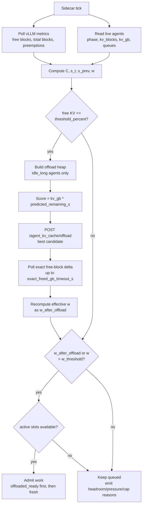
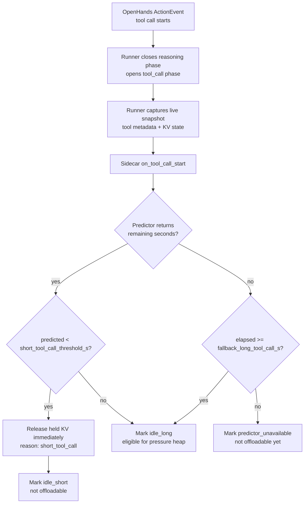
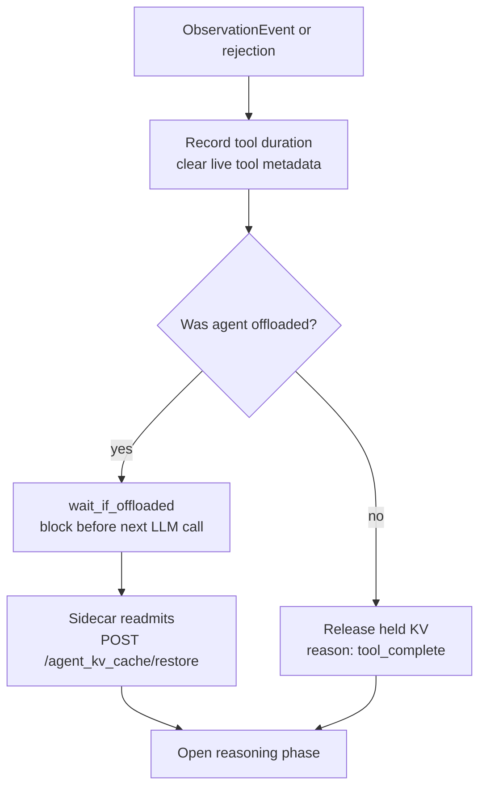
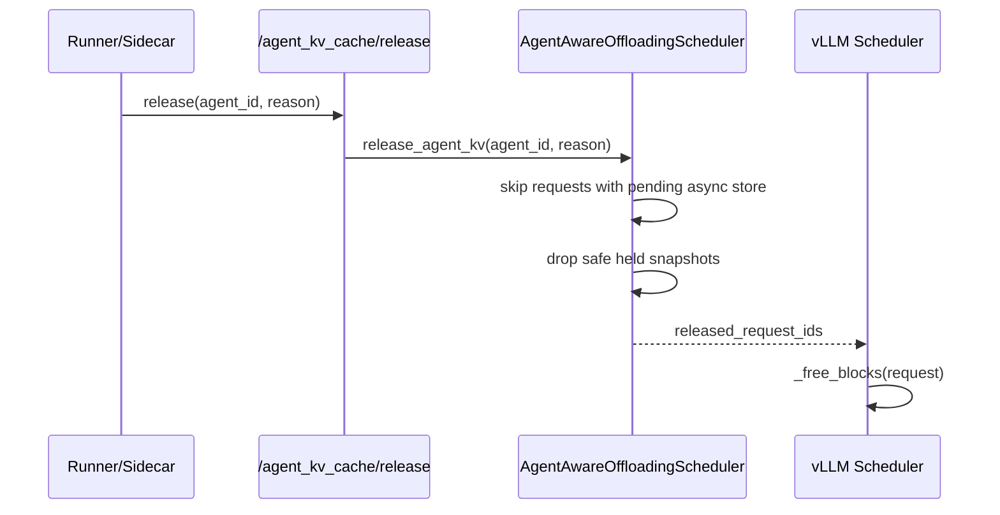
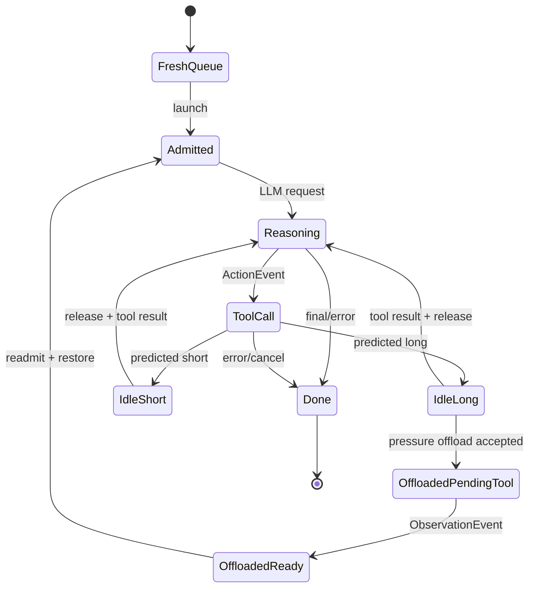
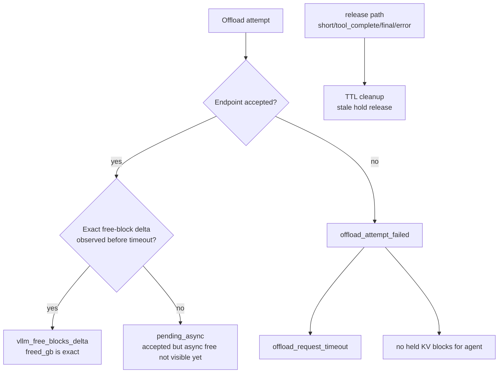

# Agent KV Offload Architecture

This document describes the current implementation of agent-aware KV admission
and offload in this repository. It focuses on the real code paths: the runner
observes OpenHands events, the sidecar decides admission and offload policy, and
the patched vLLM connector owns KV block safety.

The key invariant is:

> The sidecar chooses *whether* to offload; vLLM chooses *when blocks are safe to free*.

## 1. System Architecture

```mermaid
flowchart LR
    tasks[ABC-Bench tasks]
    runner[Instrumented OpenHands runner<br/>run_abc_bench_instrumented.py]
    sidecar[Sidecar admission controller<br/>sidecar.py]
    api[vLLM agent KV routes<br/>/offload /release /restore]
    engine[Patched vLLM engine/core/scheduler]
    conn[AgentAwareOffloadingConnector]
    worker[Connector worker<br/>async transfer]
    cpu[CPU offload manager]
    gpu[NPU/GPU KV cache]
    dash[Dashboard + JSONL/SSE telemetry]
    pred[Tool duration predictor]

    tasks -->|launch queued agents| runner
    runner -->|live agent state + Action/Observation hooks| sidecar
    pred -->|predicted remaining tool seconds| sidecar
    sidecar -->|admission/offload decisions| runner
    sidecar -->|POST agent KV control| api
    sidecar -->|tick reports| dash
    api -->|forward through vLLM client/core| engine
    engine --> conn
    conn -->|hold/release/restore state| gpu
    conn -->|store metadata| worker
    worker -->|GPU KV blocks| cpu
```



**Ownership split**

| Layer | Responsibility |
| --- | --- |
| Runner | Publishes live agent phase/KV state and calls sidecar hooks on `ActionEvent`, `ObservationEvent`, final messages, run end, and errors. |
| Sidecar | Computes pressure/headroom, classifies tool calls, queues offload attempts, and admits queued agents. |
| vLLM patch | Exposes control endpoints and forwards them to the scheduler/connector. |
| Agent connector | Holds finished agent requests, snapshots block ids/hashes, starts async store jobs, releases safe holds, and restores via prefix lookup. |
| Dashboard | Visualizes pressure, admissions, offloads, failures, and exact/pending freed-memory accounting. |

## 2. Admission Tick Flow

At every sidecar tick, `DynamicAdmissionController.on_tick()` combines vLLM KV
metrics with live agent state.

Key quantities:

- `C`: free KV capacity in GB.
- `s_t`: current average KV GB among active agents.
- `s_prev`: previous tick's active-agent average.
- `w = C / min(s_t, s_prev)`: conservative admission headroom.
- `threshold_percent`: pressure-offload threshold.
- `w_threshold`: strict admission threshold. Agents admit only when `w > w_threshold`.



Important consequences:

- `threshold_percent` is not an admission gate. It only decides when pressure
  offload should run.
- `w_threshold` is the admission gate. The default is `2.0`.
- READMITs use a priority lane ahead of fresh tasks.
- Fresh launches are still capped by `max_fresh_admits_per_tick`.
- If `max_active_agents > 0`, active slots cap both fresh admits and readmits.

## 3. Tool-Call Policy

Tool-call policy starts at `ActionEvent`, not at pressure time. The runner calls
`on_tool_call_start()` immediately when an agent begins a tool call.



When the tool result arrives:



Cleanup paths call `release_agent_kv()` on final assistant messages, run end,
errors, and cancellation. That prevents stale held KV when the normal
Action/Observation sequence is interrupted.

## 4. Safe KV Hold and Async Offload

The safety fix is "held before free." The connector delays vLLM's normal free
path at `request_finished()` for agent-tagged requests, then releases only after
an explicit release or after async offload completes.

```mermaid
sequenceDiagram
    participant S as vLLM Scheduler
    participant C as AgentAwareOffloadingScheduler
    participant W as AgentAwareOffloadingWorker
    participant CPU as CPU Offload Manager
    participant SC as Sidecar

    S->>C: request_finished(request, block_ids)
    C->>C: snapshot block_ids + block_hashes
    C-->>S: delay free = true
    Note over S,C: Request KV is held; blocks never enter the free queue.

    SC->>C: POST /agent_kv_cache/offload(agent_id)
    C->>C: mark agent pending offload
    S->>C: build_connector_meta()
    C->>W: synthetic store job from held snapshot
    W->>CPU: transfer_async(GPU KV -> CPU)
    CPU-->>W: store complete
    W-->>C: finished_sending synthetic id + real request id
    C->>C: drop hold and clear pending job
    C-->>S: real request finished_sending
    S->>S: free real request blocks normally
```

Release without offload uses the same safety boundary:



No real implementation path relies on `only_ref_cnt_zero`. The safe invariant is
not "recover blocks after ref count reaches zero"; it is "hold before free."

## 5. Agent State Machine



State naming in telemetry:

| State / field | Meaning |
| --- | --- |
| `idle_short` | Tool call predicted short; held KV is released and the agent is excluded from pressure offload. |
| `idle_long` | Tool call is eligible for pressure offload. |
| `offloaded_pending_tool` | KV offload accepted while the tool call is still running. |
| `offloaded_ready` / `offloaded_waiting` | Tool finished; runner blocks before the next LLM call until readmitted. |
| `readmitted` | Restore notification has been sent; next request can load CPU KV by prefix lookup. |

## 6. Public Interfaces

The vLLM patch adds three control endpoints:

| Endpoint | Purpose |
| --- | --- |
| `POST /agent_kv_cache/offload` | Queue held snapshots for async CPU KV offload. |
| `POST /agent_kv_cache/release` | Release held KV without CPU offload. Used for short calls, tool completion, final messages, errors, cancellation, and TTL cleanup. |
| `POST /agent_kv_cache/restore` | Notify readmission. Offloaded KV is loaded by normal OffloadingConnector prefix lookup on the next request. |

Important sidecar fields:

| Field | Meaning |
| --- | --- |
| `w` | Conservative admission headroom before offload. |
| `w_threshold` | Strict admission threshold. Agents admit only when effective `w > w_threshold`. |
| `w_after_offload` | Headroom recomputed after exact offload freeing is observed. |
| `offloads[*].pending` | The endpoint accepted async connector work, but the free-block delta may not be visible yet. |
| `freed_gb_source` | Source of freed-memory accounting: `vllm_free_blocks_delta`, `offload_endpoint`, `pending_async`, or `unavailable_exact`. |
| `held_requests` | Number of held request snapshots for the agent. |
| `known_blocks` | Number of known offloadable KV block hashes from held snapshots. |
| `offload_jobs` | Number of async store jobs already pending for the candidate. |

## 7. Accounting and Failure Modes



Operational interpretation:

| Outcome | Interpretation |
| --- | --- |
| `pending_async` | Offload was accepted. Exact freed memory may appear in a later tick after the async store completes and vLLM frees the real request id. |
| `offload_request_timeout` | The sidecar HTTP request exceeded `offload_timeout_s`. Treat it as an offload attempt failure from the sidecar perspective. |
| `no held KV blocks for agent` | The connector has no held finished request snapshot for that agent. There is nothing safe to offload. |
| `unavailable_exact` | The sidecar could not observe exact freed blocks and the endpoint did not identify the operation as pending async. |
| TTL cleanup | Stale holds are released if runner/sidecar cleanup events are missed. |

The dashboard deliberately does **not** fabricate `freed_gb` from a candidate's
estimated `kv_gb`. `freed_gb` is present only when vLLM reports an exact
free-block delta or an endpoint supplies an explicit exact value.

## 8. Implementation Map

| File | Important code paths |
| --- | --- |
| `src/sidecar.py` | `DynamicAdmissionController`, `on_tick()`, `on_tool_call_start()`, `wait_if_offloaded()`, `release_agent_kv()`. |
| `src/run_abc_bench_instrumented.py` | `ActionEvent`, `ObservationEvent`, final assistant cleanup, run-end cleanup, error cleanup. |
| `src/vllm_patches/agent_offloading_connector.py` | `request_finished()`, held snapshots, pending async jobs, `build_connector_meta()`, `update_connector_output()`, release and restore handling. |
| `src/vllm_patches/apply_patches.py` | vLLM endpoints and forwarding through async LLM, core client, engine core, and scheduler. |

## 9. Mental Model

The system is easiest to reason about as two loops:

1. **Policy loop**: runner events and vLLM metrics feed the sidecar. The sidecar
   classifies tool calls, pressure-offloads the best long idle candidate, and
   admits queued work only when headroom is above `w_threshold`.
2. **Safety loop**: vLLM snapshots and holds finished agent requests before
   free. Held KV is either released directly or copied to CPU by the existing
   async connector path before the real request id is allowed to finish.

Those loops meet at the three control endpoints, but the invariant remains
inside vLLM: blocks are never copied after entering the free queue.
